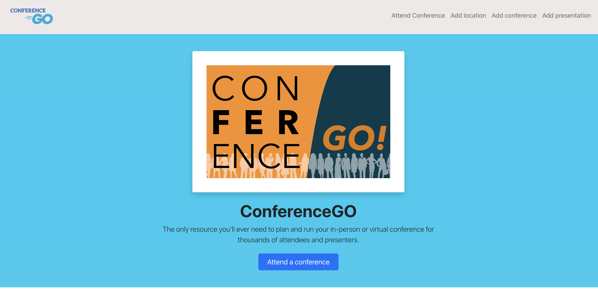
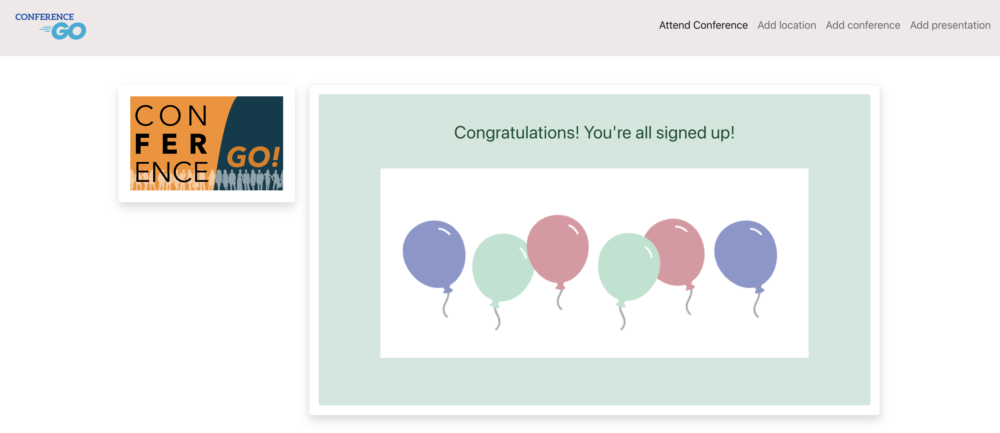
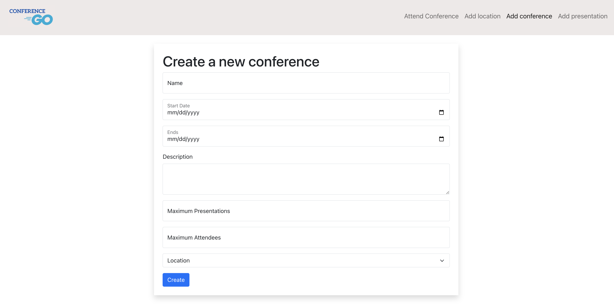
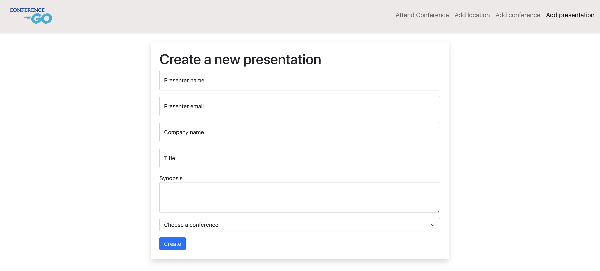
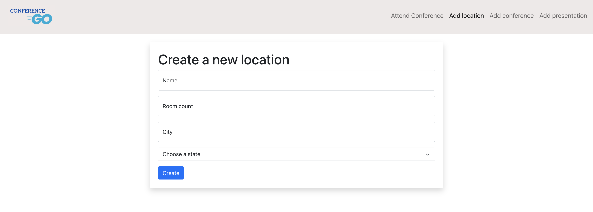

## Home page

This is the home page that users will see when they get to the website. The user can click on any item within the navigation bar or can click the "Attend a Conference" button. Below that, upcoming conferences that have been entered into the database are listed. Each conference card includes the name of the conference, the location of the conference, an image of the city where the conferene is located, a description of the conference, the number of presentations, the number of maximum attendees, the current weather in that location, and the start and end dates. 

## Attend Conference

This is a form that can be completed where the user chooses the conference they would like to attend and inputs their information. The success message appears when a user successfully signs up for a conference.

## Conference Form

This is a form that can be completed by anyone who would like to input new conference information.

## Presentation Form

This is the form that can be submitted by anyone who would to submit a presentation proposal.

## Add Location

This is where a user can input a new location if a conference they would like to create is in a location that is not already in the database.

